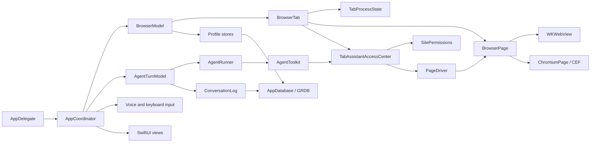

<!-- Modified for WSurf by wsagency in 2026; based on Linen by Kavoye. -->
# Architecture

WSurf is a macOS SwiftUI app with default WebKit and on-demand embedded Chromium
through CEF. Swift 6 strict concurrency and Main Actor default isolation are enabled.

## Runtime structure

`AppCoordinator` owns and connects the runtime models and services. Views observe
the coordinator and its focused models; they should not contain persistence, networking or
WebKit policy. New work should prefer a narrow model or protocol over another
coordinator responsibility.

`VoiceInputModel` owns microphone and transcription state. `AgentTurnModel`
owns one turn’s task, reply, tab activity and durable completion state. Both
models expose small observable values while their service dependencies stay
outside observation.

## Browser state

`BrowserModel` owns tab and folder order, activation, session restoration and
history integration. `BrowserTab` owns a `BrowserPage` backed by exactly one
WebKit or Chromium view. `TabProcessState` owns process-protection signals,
unload status and unexpected-termination throttling. `WebViewPool` prepares
WebKit views without owning tab state.

A restored tab holds no browser view until opened. `BrowserTab.page` builds the
selected engine on first use; callers iterating tabs must check `isMaterialised`
before accessing it. Unloading retains the link and metadata, not live page
content. WebKit can restore native interaction state; Chromium restores only
the URL. An engine switch reloads without replaying submitted requests and
awaits the old browser's actual close acknowledgment before installing its replacement.

Each profile has its own WebKit data store, Chromium request context and cache,
database, permission records and extension directory. Engine choices belong to
that profile's canonical HTTP(S) origins. Private browsing uses non-persistent
website stores and an in-memory database. Never add profile identity as a column
to a shared persistent store.

`BrowserModel` owns the active profile’s permission store and gives that exact
store to every new `BrowserTab`. A profile switch writes the outgoing session,
drops its tabs without the bookkeeping a single close needs, replaces the
database and permission store together, swaps the extension controller, and
restores the next session. The extensions themselves load afterwards, so the
window is usable first. Each phase logs its own duration under `profile:
switched`.

`ChromiumRuntime` initializes CEF only for the first Chromium page and stays
initialized until quit because CEF cannot be restarted in-process. Its AppKit
application subclass is installed at startup without loading Chromium.
The native child host view must be released to receive `on_before_close`; a
tab closes that child, never the containing WSurf window.

## Agent trust boundaries

The model is not a security boundary. Page text is untrusted, even when the
model describes it as an instruction.

- `AgentToolkit` exposes the supported browser actions.
- `TabAssistantAccessCenter` authorizes visible-page reads and controls by
  origin before `AgentToolkit` reaches the page driver.
- `PageDriver` resolves actual page elements and enforces sensitive-field and
  consequential-action rules.
- `AgentActionConsent` asks from trusted app UI. The model cannot suppress it.
- `AgentActionPolicy` stores narrow, revocable category-and-host grants.
- `ConversationLog` persists the activity trail inside the active profile.

Background research uses a non-persistent WebKit data store for each task. It
does not inherit cookies, logins or website storage from the active profile.
Loading the chosen result into a tab does not grant the assistant access to it.

Add enforcement below the model prompt. Prompts can improve behavior but cannot
authorize access, protect credentials or confirm an irreversible action.

External MCP clients use a separate `MCPBrowserSession`, with explicit tab-and-
origin grants and connection-local consequential-action approvals. The session
uses `PageDriver` through a revocable `PageAutomationGuard`; it does not enter
`AgentTurnModel` or write assistant conversation history. Private browsing and
profile switches stop the server synchronously before replacing stores. The
bundled `--mcp` process relays stdio to a user-only Unix socket without opening a
second browser session. See [MCP.md](MCP.md) for the tool contract and boundaries.

MCP enablement is an app-level preference. Runtime shutdown clears connections
and grants without changing that preference. Bootstrap and profile-switch
completion resume the listener in normal profiles; private browsing keeps it
paused and presents the toggle as unavailable.

`MCPClientInstaller` handles optional client setup on its own actor. It merges
standard JSON configs and uses the installed Codex CLI on a staged TOML copy.
`MCPConfigurationFile` owns private backups and checked atomic replacement.
These services have no browser, profile, assistant, or sharing-grant dependency.

## Assistant execution and context

Providers propose actions. WSurf checks permissions, runs each action once, and
saves its result in a checkpoint. Resuming an interrupted task preserves user
answers and requires verification before retrying an action with an unknown outcome.
Repeated failures or unchanged results eventually pause the task.

Conversation messages, attachments, and checkpoints belong to the active profile.
They are private conversation data, not diagnostic exports. Deleting a turn also
invalidates checkpoints that may contain it. `AgentRunDiagnostics` exports only
approved event names, counts, timings, and status values. It excludes prompts,
answers, page content, URLs, tool arguments, credentials, and raw provider errors.

Automatic and manual compaction use the selected provider. The portable compactor
summarizes chronological evidence in bounded slices. It preserves the latest user
request, exact answers to questions, and complete recent tool exchanges where they
fit. Page content and tool results remain untrusted input. A failed or cancelled
compaction leaves the original checkpoint intact. On-device compaction stays on
device. The OpenAI adapter also preserves native Responses state.

The context indicator estimates occupancy, including tool definitions. It does
not report measured provider token usage. Progress updates remain in private chat
history; diagnostics record only their event type and status.

See [OpenAI integration](OPENAI.md) for provider configuration and validation,
and [Browser autofill](WSurf/Web/Autofill/README.md) for form and credential handling.

## State and SwiftUI

Shared mutable models use Observation. View-local state is private. A distinct
screen or independently changing section should be a real `View` type with
narrow inputs; a computed `some View` property does not create an observation
boundary.

Use the components and metrics in `WSurf/UI/Chrome` and
`WSurf/Settings/SettingsPrimitives.swift`. `Theme` owns shared visual tokens.
User-facing strings remain localizable; protocol values, URLs, model IDs and
third-party error text remain verbatim.

## Persistence

GRDB stores structured browser and agent data. Small preferences use
`UserDefaults`; provider secrets use Keychain. File-backed models — profiles,
website permissions, page zoom and the download list — use atomic writes through
the support layer. A write needed for quit or profile teardown
must be awaited or flushed synchronously before its owner is released.

## Tests

Tests use Swift Testing, with XCTest for the two things it cannot express:
performance baselines (`XCTMetric`) and a test that drives the main run loop.
Prefer pure parsing and policy functions, injected stores, temporary databases
and local WebKit fixtures. `HTTPFixtureServer` serves deterministic loopback
pages for navigation and origin-boundary tests. A test should assert a
user-observable result or an enforced invariant. Live services and fixed sleeps
do not belong in the default suite.

Tests use a per-process temporary directory from `AppDatabase.supportDirectory`.
Profiles, permissions, zoom state and the download list do not access an
installed copy’s support directory.

`WebViewGate` bounds how many cases hold a live `WKWebView` at once, at half the
machine’s cores. The `.boundedWebViews` trait takes a slot; apply it to the
tests that build a view rather than to a whole suite, so the rest do not queue
for a resource they never use.

`WSurf.xctestplan` turns on per-test timeouts: 120 seconds by default, 300 at
most. A stalled test times out and reports its name without blocking the full run.

CI runs the full suite with code coverage and rejects app-target coverage below
the repository floor. See [CONTRIBUTING.md](CONTRIBUTING.md) for the change
checklist.
